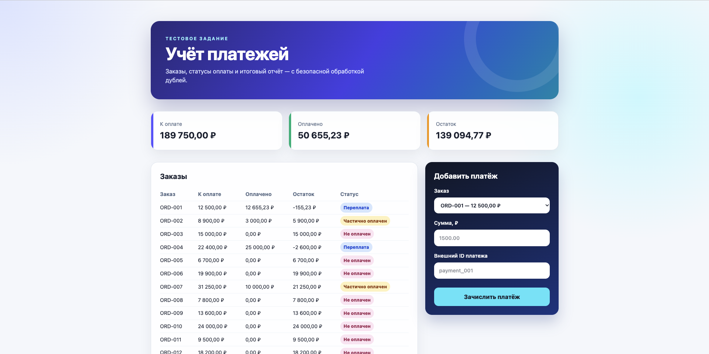
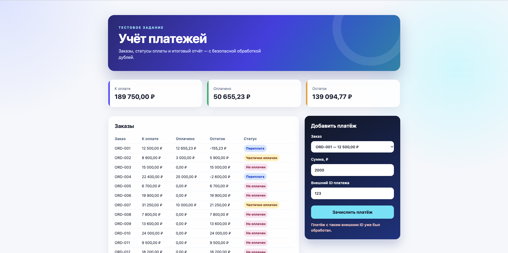

# Модуль учёта платежей

Тестовое решение для учёта оплаты заказов. Содержит 12 тестовых заказов, интерфейс отчёта и форму добавления платежей.

## Скриншоты



Повторное событие с тем же внешним ID не создаёт новую операцию:



## Стек

- **React + Vite**: компактный интерфейс для просмотра отчёта и внесения платежа.
- **tRPC + Express**: типобезопасное API без дублирования DTO между фронтендом и бэкендом. Express выбран вместо NestJS, чтобы не раздувать небольшое тестовое приложение модулями и декораторами.
- **PostgreSQL + Drizzle ORM**: надёжное хранение, миграции и транзакции.
- **Vitest**: проверка правил расчёта статусов.

## Архитектура

Backend следует направлению зависимостей `presentation → application → domain`; слой инфраструктуры реализует интерфейсы application-слоя и не попадает в доменную логику.

```
src/server/
  presentation/trpc/    # tRPC transport, input-схемы и composition root
  application/          # use cases и порты (интерфейсы репозиториев)
  domain/               # DTO, относящиеся к платежному модулю
  infrastructure/       # PostgreSQL-реализация репозитория
  db/                   # Drizzle-схема и соединение
```

Frontend организован по назначению: `pages` собирает экран, `features` содержит пользовательские сценарии, `entities` — UI/модель заказа, `shared` — переиспользуемые утилиты и API-клиент. Страница не содержит платёжной бизнес-логики, а tRPC-вызовы локализованы в соответствующих feature/page-модулях.

## Локальный запуск

```bash
cp .env.example .env
docker compose up -d
npm install
npm run db:migrate
npm run db:seed
npm run dev
```

Интерфейс будет доступен на `http://localhost:5173`, tRPC API — на `http://localhost:3001/trpc`.

`db:generate` нужен только после изменения Drizzle-схемы. Для запуска он не требуется: актуальная миграция уже находится в `drizzle/`.

## Проверки

```bash
npm run lint
npm test
npm run build
```

Сейчас 20 тестов покрывают доменные правила расчёта, идемпотентность при конкурирующей записи, преобразование денежных сумм и ключевые UI-сценарии формы и дашборда.

## Production-деплой

Для демо достаточно одного VPS с Docker и доменным именем. Caddy автоматически выпустит и продлит HTTPS-сертификат, если DNS-запись домена указывает на VPS и открыты порты 80/443.

```bash
cp .env.production.example .env.production
# Указать домен и надёжный пароль PostgreSQL в .env.production
docker compose --env-file .env.production -f docker-compose.production.yml up -d --build
```

Внешний трафик принимает только Caddy; PostgreSQL доступна только внутри Docker-сети. При первом запуске отдельные контейнеры применяют миграции и добавляют демонстрационные данные. Seed безопасен для повторных запусков: если в БД уже есть заказы, он ничего не изменит. Проверка работоспособности: `https://ваш-домен/health`.

## Модель и правила

Денежные суммы хранятся в минимальных единицах валюты (`integer`), а не `float`, чтобы избежать ошибок округления. У заказа есть сумма к оплате и денормализованный статус; платежи - отдельная таблица.

| Статус           | Условие                                             |
| ---------------- | --------------------------------------------------- |
| `unpaid`         | Платежей нет                                        |
| `partially_paid` | Оплачено больше нуля, но меньше суммы заказа        |
| `paid`           | Сумма платежей точно равна заказу                   |
| `overpaid`       | Сумма платежей больше заказа; остаток отрицательный |

Каждый платёж имеет `externalId` с уникальным индексом. Это ключ идемпотентности: повторная доставка одного webhook-а не создаст второй платёж. Внесение платежа, пересчёт всех платежей заказа и обновление статуса выполняются внутри транзакции; строка заказа блокируется через `FOR UPDATE`.

Форма в интерфейсе имитирует уже полученное платёжное событие: пользователь вручную вводит сумму и внешний ID. Интеграции с реальным платёжным шлюзом в тестовом проекте нет. В боевом сценарии этот ID и сумма пришли бы из webhook-а провайдера после проверки его подписи.

## Что добавил бы для production

- Проверку подписи webhook-ов, таблицу сырых событий и журнал аудита.
- Outbox/очередь для повторной доставки событий и интеграций.
- Роли, авторизацию, rate limiting, метрики, структурированные логи и алерты.
- Разделение на сервисы только после появления подтверждённой нагрузки и границ домена.
- Отдельный процесс возвратов и ручного разбора расхождений.
